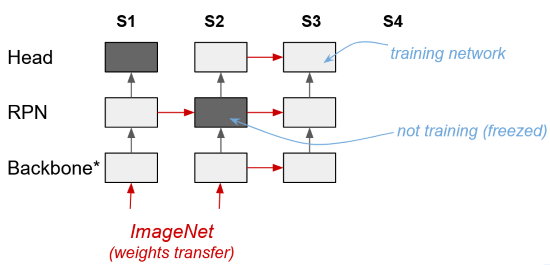

# Mask RCNN TensorFlow 2.0 with integration testing

A custom mask-rcnn model written from zero with Tensorflow 2. The associated integration testing (made with PyUnit) 
verifies that the _train_, _test_ and _predict_ modules instantiate and work correctly. 

* **Added backbones:** ResNet 50 & 101 [`resnet50`, `resnet101` as default], DenseNet 201 [`densenet2021`], Xception [`xception`]
* **Dataset used:** iSAID-DOTAv1 (https://captain-whu.github.io/iSAID/dataset.html) whish consists of aerial images with 
objects e.g., planes, ships, vehicles, storage tanks and bridges.

## Getting started

(1) Run with Python console, e.g. the train module:
```
python train.py --gpu_memory 0.2 --gpu_device 1 --model_folder model_001 --weight_folder weights_e546_s10_20230428-1908
```
The above-witten options give you possibilities to limit the usage of GPU memory up to 20% for this training, 
considering the GPU device 1 (if your infrastructure consists of 2 or more GPUs). Variables of the previously 
trained model `model_001` are restored from the associated weight folder `weights_e546_s10_20230428-1908`.

For debugging purpose, you may add `--run_eagerly True` to run the model in eagerly mode. All model and training
configurations are made via `config.py` prior to training.

(2) Running the _predict_ module will generate and display boxes for a random image collected from the testing set
of the data considered. The number and type of boxes, including their scores and associated masks can be 
chosen accordingly.
```
python predict.py --model_folder model_001 --weight_folder weights_e546_s10_20230428-1908 --rpn_detection True --rpn_obj_thresh 0.7
```
The above-witten options give you possibilities to load the variables of a trained model, and to generate boxes from
the RPN branch only (detection) of mask-rcnn. Boxes whose object score exceeds or equals a threshold value indicated
be `--rpn_obj_thresh` will be considered valid. Setting `--rpn_obj_thresh` to False will make the head branch of
mask-rcnn generating boxes instead (with class scores and masks, as opposed to boxes from the RPN branch with
associated object scores).

**Other options:**
* **nms_iou_thresh:** A threshold value above which two prediction boxes are considered duplicates.
* **min_score:** Minimum class score for predictions.
* **mask_threshold:** The threshold value for binary masking.
* **soft_nms_sigma:** Soft-NMS parameter. Deactivated if set to 0.
* **nms_top_n:** Maximum number of objects to detect in from input.
* **show_class_names:** If True, display the class name of predicted objects.
* **hide_below_threshold:** If True, predictions whose class scores are below the specified threshold are not displayed.
* **hide_bg_class:** If True, background predictions are not displayed.

(3) Running the `integration_testing` module will test steps of training and testing, including the loading of 
model variables:
```
python integration_testing.py
```
The test criteria do not pinpoint critical parts of the mask-rcnn modules; the test case was rather written for 
templating purposes in case future users may want to change and try the modules after modifications.

## Integrated
* An anchor grid densifier module to spatially increas the density of box anchors. This density increase is made
possible via a backbone layer customization:


The controlling option in `config.py` has a level of 2 (by default) to deal with small objects.
```python
ANCHOR_DENSITY_LEVEL = 2  # default value is 0 (no density increase); each level increase density by power of 2
```

* **Adam** and **SGD** optimizer, with learning rate decay and cyclicity mode.
```python
LEARNING_RATE = 1e-4  # if cyclic decay, this corresponds to maximum learning rate
MINIMUM_LEARNING_RATE = 5e-6  # if cyclic decay, this corresponds to base learning rate
MOMENTUM = 0.9  # SGD parameter, only relevant if ADAM_OPTIMIZER is False
NESTEROV = True  # SGD parameter, only relevant if ADAM_OPTIMIZER is False
LR_DECAY = True  # if True, actives learning rate decay
LR_DECAY_STEPS = 100  # decay step
LR_DECAY_RATE = 0.90
LR_DECAY_STAIRCASE = True  # if True, use a staircase function type for decay
LR_CYCLIC = False  # if True, apply cyclic LR. WARNING: LR_DECAY must also be True
CYCLIC_STEP_SIZE = 50  # number of training iterations per half cycle
CYCLIC_GAMMA = 0.9991  # function amplitude scaling factor
ADAM_OPTIMIZER = True  # if True, use Adam optimization (SGD otherwise)
```

The below graph shows an example of cyclic learning rate with decay over 8k+ steps of training.


* A bounding boxe displayer in Tensorboard summary (for _RPN_ and _head_ network predictions) while training, to
evaluate the networks' progressions visually. The below-example shows boxes generated (in red) by _RPN_ (left) and 
the _head_ network (right), compared to ground truth boxes (in green).

* Full control on weight loading and training over the different parts of mask-rcnn (_backbone_, _RPN_, _head_ and 
_mask_ networks) to give possibilities in training the model with specific scheduling. The below-example shows 
a 3-step scheduling: 

  * **S1**: Train backbone + RPN separately from head network (which is freezed).
  * **S2**: Transfer/freeze RPN weights, train backbone + head networks. 
  * **S3**: Transfer all weights + train full network scheme.



```python
# Weight loadings.
LOAD_IMAGENET_WEIGHTS = True  # apply ImageNet weights to backbone
LOAD_BACKBONE_WEIGHTS = True  # restore backbone weights from restored model (overwrites ImageNet weights)
LOAD_RPN_WEIGHTS = True
LOAD_HEAD_WEIGHTS = True
LOAD_MASK_WEIGHTS = True
LOAD_CHECKPOINT = True

# Training modes.
TRAIN_BACKBONE = False  # if False, freeze all layers of the backbone network (not trained)
TRAIN_RPN = True  # if False, freeze all layers of the RPN network (not trained)
TRAIN_HEAD = True
TRAIN_HEAD_CLS = True  # if False, do not train the classifier of the HEAD network
TRAIN_HEAD_REG = True
TRAIN_MASK = True  # if False, do not train on mask
```
* Evaluation with **PASCAL VOC** metric AP@.50 calculated from precision-recall (PR) curves.

## Notes
* The mask-rcnn pipeline currently only manages a batch of 1, although the batch size is considered internally in the
model. Future users may want to change the workflow accordingly to increase the batch size.
* This implementation is well worked under TensorFlow/Keras 2.6.0, Cuda 10.0.130 and CuDNN 7.6.5
* `generator.py` in the `src` folder must be modified for other custom dataset.
* Make sure to change `config.py` prior to training a model. Weight and summary folders are saved with associated
model names in the `results` folder. Use TensorBoard with `--logdir results/summary` to display metrics from the 
different models trained (_train_ and _validation_ metrics).